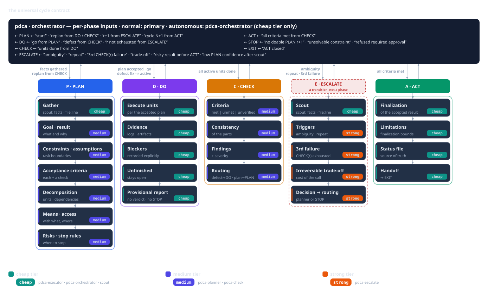
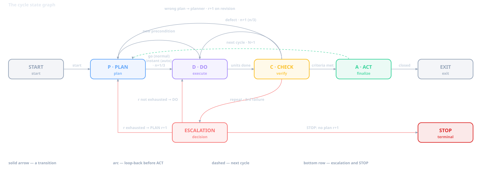

# Beyond vibe coding

Vibe coding sped up development to an indecent degree: on a strong model a working prototype appears within minutes, and there's no need to plan or dig in — the model fills in the details itself. The price of that speed is unpredictability. Success isn't defined in advance, "done" stays a self-assessment, and the result isn't reproducible: the same request yields a different solution. The `pdca` skill doesn't cancel vibe coding; it adds a **verifiable result** to it — PLAN → DO → CHECK → ACT with gates, independent verification, and a report on disk.

## Vibe coding: why it works

Early in 2025, Andrej Karpathy described a style in which a programmer "gives in fully to the vibes" and forgets that the code exists at all. The phrasing is a joke, but there's a real shift behind it.

- **The barrier to entry drops.** You don't have to remember the syntax, the library, or the exact API — describing what you want in words is enough.
- **Feedback is instant.** Edit, run, next edit happen in seconds, without the build-and-review ritual.
- **A strong model fills in what's missing.** Boilerplate, configuration, and small mistakes — it handles them itself while you keep the intent in your head.
- **Disposable work is its element.** A prototype, a script "for today", a demo of an idea, a reconnaissance of an unfamiliar technology: here vibe coding is nearly unbeatable.

As long as you need the result just to "feel out" an idea, it's an honest deal: speed in exchange for control.

## Where vibe coding breaks

The problems start when you need something beyond "looks like it works" from the result — reproducibility, explainability, repeatability, or a high cost of error.

- **Success isn't defined in advance.** No criterion — so "done" is decided by the author. That's an opinion, not a fact, and there's nothing to check it against.
- **State lives in the session.** After compaction (the host compresses the context) or in a new session, it's unclear where you stopped, what was done, and why: the context reset, and the work starts over.
- **Mistakes aren't punished.** A failure doesn't stop it from "trying again" the same way: identical retries look like progress even though they're going in circles.
- **The result isn't reproducible.** The same request to the same model yields a different answer — sometimes a broken one. You can't take that on faith.

Together, that's what unpredictability is: vibe coding can produce a result, but it doesn't promise it'll be the one you need or that you'll be able to repeat it.

## From vibe coding to a cycle

These problems share a root: the model's ordinary work is a sequence of actions ("read, fix, run, say it's done"), not a path to a verifiable result. The `pdca` skill replaces the sequence with a **cycle**. The idea is borrowed from the management cycle Plan — Do — Check — Act: plan, do, verify independently, finish — or return to the plan. In the contract it's a state machine with **gates**: a gate is a condition under which the next step is allowed. A gate checks the **presence** of the required items, not quality. The promise is modest: the cycle doesn't guarantee the right result, but it won't let you close work without verification, silently lose state, or pass off identical retries as progress.

`pdca` is a **domain-neutral** skill: it names only **roles** and **phases** and imposes neither artifacts, nor task types, nor domain examples. What the result will be — a report, a document, a config, a plan — is decided by the planning phase; that's also what chooses the way to verify it. So `pdca` is worth picking for a task with a **verifiable result**: you can name the success criteria and the way to check them in advance.

## Responsibility

A cycle has a fixed set of **roles**. A role is not a person and not a specific model, but a function with permissions. A **tier** (cheap / medium / strong) is a label for a model's cost and quality, **not** an authority: a cheap role can have more permissions than an expensive one. The host binds specific agents and models (the host is the run environment, the "harness"); the skill names only roles.

| Role | What it does | Tier |
|---|---|---|
| GATHER — Scout | Collects pointers `file:line`, URLs, numbers; no recommendations | cheap |
| PLAN — Analyst | Goal, acceptance criteria, decomposition, risks, verification method | medium |
| DO — Executor | Edits files, runs commands, keeps the status file (the cycle's state on disk) | cheap |
| CHECK — Auditor | Independently verifies every criterion against actual evidence | medium |
| ESCALATE — Expert | The instance for hard decisions | strong |
| RUNNER — Orchestrator | Drives the cycle, reading and editing nothing | cheap |

The table holds as long as a few rules are respected:

- **The orchestrator drives the cycle, reading and changing nothing — dispatch only.** It calls the roles through `Task` (the subagent-launch tool), passing information from one to another. But it doesn't write the plan, read files, or run commands; the exception is updating the task list (`todowrite`).
- **The plan always belongs to the analyst.** It both forms the initial plan and revises it when the corresponding signal arrives.
- **Only the executor may write and run**, including the status file.
- **The auditor is independent of the author.** It judges by the aggregated report with fresh runs and facts from the scout.

From these rules follow three prohibitions on "self". **Self-verdict**: the executor does the work, and an independent auditor accepts it — if the author decided for itself that the criteria were met, verification would turn into a self-report, so the executor neither renders the verdict nor declares STOP, and the auditor doesn't verify its own work. **Self-editing**: only the executor may write and run, otherwise the source of changes splits in two and the author ends up the judge of its own edit. **Self-reading**: a file once read can't be evicted from the context, so raw data is read only by the scout, which returns pointers, and the orchestrator merely dispatches and doesn't substitute for the roles.

## How the cycle runs

The cycle's state machine looks like this:

**PLAN.** The analyst decomposes the goal and answers what result is needed. The goal must be present at the cycle's entry: it's formulated in advance and can't be changed. The decomposition goes down to atomic, indivisible tasks with clear boundaries — **units**. A unit is one verifiable piece of work with its own acceptance criteria. The plan's mandatory fields:

- the goal and the expected result;
- constraints and assumptions;
- acceptance criteria — **each with a verification method**;
- decomposition with dependencies, or an explicit decision not to split;
- means and access;
- risks and stopping conditions.

A gap in the input data is closed with a fact, an explicit assumption/risk, or a blocker/escalation; guesses are forbidden.

**DO.** The executor does only what the plan says; a change beyond the unit — "Over-Reach" — is a separate task. The verdict and STOP aren't its job: it returns to the orchestrator a hypothesis, a **preliminary candidate with evidence**, and the answer "the result is achieved" never closes the cycle — the verdict belongs to CHECK.

**CHECK.** The auditor judges every answer **against actual evidence** and checks that the evidence isn't self-contradictory. Statuses: `met` (satisfied), `unmet` (not satisfied), `unverified` (not verified). The absence of verification isn't a pass: without numbers and pointers a criterion gets `unverified`, not `met`. The output is a verdict, a criteria matrix, findings, and routing: an implementation defect → DO, a wrong plan → PLAN.

**ACT.** Closes the cycle: fixes the conclusions, limitations, status, and handover, and finalizes the status file. Without ACT the cycle can't be closed, and without an accepted verification there's no ACT; `rework`/`replan` aren't part of ACT but **returns before** it.

**Returns.** `CHECK → DO` — an implementation defect: fix and check again. `CHECK → PLAN` — a wrong plan: the analyst issues a new revision. `DO → PLAN` — a new precondition or blocker: not a unilateral revision, but a candidate for the analyst to consider.

When the set of units changes mid-work, it's important to distinguish two cases.

If it turns out that one more thing must be done before the current unit, the plan simply *adds* a new active unit, and the original stays in the `blocked` status and keeps all its criteria. There's no mapping between them and none is needed: the new unit doesn't replace the old one, it merely comes before it — once it's done, the original unblocks and is brought to `done` by its own criteria. This is called an **additive precondition**.

If the original unit is no longer achievable, a new one supersedes it. The original is marked `superseded`, and this is a genuine substitution. So that requirements aren't lost in the supersession, a "superseded → replacement" mapping is mandatory: the new unit inherits all the criteria of the original, and CHECK still verifies them. Without such a mapping, superseding is forbidden — otherwise some requirements quietly evaporate. This is called a **scope replacement**.

In short: with an additive precondition the original unit lives on (`blocked`) and there's no mapping; with a scope replacement it dies (`superseded`), and a mapping with all its criteria is mandatory.

**Five gates** allow the transitions:

1. **Plan → DO:** all mandatory fields are present, the plan is written to the status file, and approval is obtained from the user or the orchestrator.
2. **DO → CHECK:** all active, non-superseded units are `done` with evidence.
3. **CHECK → ACT:** all criteria are `met` on actual data, not a single `unmet`/`unverified`.
4. **ACT → EXIT:** the result and the status file are finalized.
5. **STOP:** a separate finalization, outside the series of transitions above.

Two invariants are inviolable: **you can't skip CHECK** and **you can't close the cycle without ACT**.

Progress is tracked by **three counters** and a **defect history**:

- `N` — the number of the task's cycle in the file name `.pdca/status/<task>-<N>.md`; it grows only in ACT, when the next cycle of the same task is planned.
- `r` — the plan revision; it grows only with a genuinely different plan.
- `n/3` — the attempt at executing the current revision: starts at 1, `CHECK → DO` increments it, and a new revision resets it to 1.
- **Defect history** — one line per stable defect key (revisions/attempts, number of fixes, pointers, escalation outcome); it isn't erased by a revision or a new session.

A rejected candidate with an unchanged plan is **not** a revision: `r` and `n` don't change; renaming or resetting the session doesn't "produce" a revision. The counters and the history live in the status file. They help tell "one more attempt" from a revision and to call escalation in time: **a repeat of the same defect after one fix** is a signal earlier than three different failures; after a revision's third failed CHECK there's no fourth attempt.

**Modes.** In **normal** mode, after the plan is written the orchestrator shows its gist, gives a path to the status file, and asks to confirm the plan — this is the **only** start signal. Without confirmation, nothing is created or edited except the status file. In **autonomous** mode the same contract runs without pauses or questions: transitions happen in the same turn the gate is passed, nothing "for the user" is printed, and notifications (an unavailable role, recovery after compaction, an assumption instead of a question) are written to the status file as `Notice:` (a notice entry). No questions are asked: anything unresolvable leads to STOP.

**Memory and evidence.** The **cycle status file** is the source of truth for the plan and progress. It lives on disk, survives compaction and a new session, and the executor updates it on every event. The **todo list** in the sidebar is merely a session mirror that's lost in a new session; it is never the source of truth. After compaction, state is restored from the status file (via the scout), not from memory. The cycle closes only on **fresh evidence** — exit codes, numbers, a path to a log, `file:line` — and never on a claim, including subagents' reports. Marker words like "should work", "probably" are a signal to schedule a re-run: **a report ≠ a result**.

## A teaching story: when the cycle stops

> This is a **teaching illustration**, not a source of the rule. It shows the transitions and STOP schematically; the exact wording is in the skill's materials.

Imagine a task: answer whether caching intermediate results speeds up a nightly report. The analyst in PLAN r1 formulates the criteria: (1) run times with and without the cache on the same dataset; (2) the conclusion follows from the numbers; (3) the methodology is reproducible. Units: a baseline measurement, a measurement with the cache, writing up the conclusion. The plan is written, the user types `go` — DO begins (`N=1`, `r=1`, `n=1`).

During DO the executor discovers that the promised dataset of the needed size isn't available. Fixing the plan unilaterally is forbidden: DO returns a preliminary candidate, and the analyst classifies it as an **additive precondition** — the "measurement with the cache" unit stays active but `blocked` on the dependency, and a new active unit "obtain the dataset" is added. This isn't a scope replacement, so no mapping is needed. The precondition is closed, the measurements are taken, the conclusion is written up, DO → CHECK.

CHECK in revision r1 returns `unmet` on the "methodology is reproducible" criterion: the numbers are there, but the methodology is described incompletely. This is an implementation defect, the cycle returns `CHECK → DO`, `n`=2. The executor expands the description; a re-check of the same revision again returns `unmet` on the same criterion. The same defect came back after one fix — a signal to **escalate before a second fix**, and the orchestrator calls the expert. The escalation finds that the needed dataset can't be obtained in the permitted environment, and without it the criterion can't be met; there's no revised plan that keeps the original criterion. The cycle ends in **STOP**: the remaining `unmet`/`unverified` criteria are recorded, along with the counters (`N=1`, `r=1`, `n=2/3`) and the defect history — **with no false PASS and no ACT success**. There's no fourth attempt, and STOP doesn't bypass it.

This outcome isn't a failure of discipline: the cycle stopped where the verifiable result was exhausted, and kept a record of why. And it's not "try a little harder": the "no fourth attempt" rule holds after escalation too.

Now let's compare with vibe coding. There the model wouldn't have stopped at this point: it would have made a fourth and a fifth attempt and each time confidently reported "now it definitely works". An impossible criterion it would have quietly softened — picked a different dataset, lowered the bar, or simply declared it met without verification: there's no independent CHECK, and no one to catch it. The reason for the stop wouldn't be saved anywhere — instead a confident "done", and you'd learn about the failed criterion later or never. There's simply no "no fourth attempt" rule there: retries are free and endless, and the model keeps hammering away, burning tokens and drifting from the goal. What looks like "gave up" in the cycle is precisely the honest outcome that vibe coding doesn't produce: a stop with a recorded reason instead of endless confident churn.

## Trade-offs

Nothing is free, and the cycle is no exception. The main downsides:

- **More expensive.** The cycle involves several roles, some on the medium and expensive tiers, and independent verification requires fresh runs. Strictly speaking, though, this holds only for simple tasks — on complex ones the arithmetic is reversed, see the next section.
- **Slower.** The gates, the independent CHECK, and keeping the status file add steps and increase execution time.
- **More complex.** You have to stand up the roles and tiers, and watch the status file and gates — the barrier to entry is higher than a single prompt.

This is the price of predictability: a verifiable result and an honest stop. On a small or one-off task the cycle may not pay off — in such cases it's more appropriate to tell the model by hand what to fix and where. The `pdca` cycle suits complex tasks with a large context that simply may not fit into one session under vibe coding. The cycle is very successful for corporate solutions, where people are willing to pay with greater token and time consumption for a quality result.

## The economics of tiers: cheaper doesn't mean worse

Above I honestly wrote "more expensive" — and I confirm it: a formalized cycle costs more in time, in tokens, and, of course, in money. But the caveat here matters more than the admission itself: this holds as long as the comparison is against one or a few prompts. On simple tasks, where neither the developer nor the model can "lose" the context, vibe coding is unconditionally cheaper — and the cycle isn't needed there at all. On complex tasks that's not so: the cost of vibe coding stops being the cost of prompts and is made up of session restarts, re-explanations of the task, the model's wanderings that burn tokens while drifting from the goal, and the developer's hours restoring the thread of reasoning. This hidden part of the bill grows with the task's complexity, while the cycle's overhead doesn't. So for complex tasks the honest comparison isn't "a prompt vs a cycle" but "a day of vibe coding vs a day in the cycle". And that's where the arithmetic flips.

The key to the economics is separating volume from judgment. In a well-decomposed cycle, the overwhelming majority of tokens go to mechanics: read a file, apply an edit, run the tests, collect excerpts. Judgment — "what do we do next", "does it count" — is compact and rare. Tiering is exactly the routing of these two streams: volume to cheap, judgment to medium, dead-end analysis to strong. Paying a flagship price for a ten-line edit is like hiring an architect to repaper the walls.

At the same time, "with no loss of quality" isn't a hope but a consequence of the very prohibitions from the "Responsibility" section. A cheap executor renders no verdicts: its work is accepted by an independent CHECK on the medium tier — with evidence and fresh runs. Quality is held by the cycle's structure, not by the model's price at every individual step. Remove the ban on self-verdict and the savings instantly turn into a loss of quality.

### Numbers instead of gut feelings

A real-usage snapshot: 12 hours of work, 159 sessions, 3829 messages, $7.34 in total. The distribution by tier:

| Tier | Messages | Input, tok. | Output, tok. | Cost | Budget share |
| --- | --- | --- | --- | --- | --- |
| cheap | 3485 (91%) | 371.1M | 3.12M | $4.44 | 60% |
| medium | 113 (3%) | 3.36M | 116.5k | $2.70 | 37% |
| strong | 4 (0.1%) | 50.4k | 11.5k | $0.20 | 3% |

Input here is all input tokens (fresh plus cache reads and writes); output is the answer together with reasoning: in billing, reasoning counts as output.

I'll start with strong: four calls for twenty cents over twelve hours. The expensive tier works like insurance — nearly free while everything runs normally, and priceless when the cycle is stuck. Its alternative is a fourth and fifth blind attempt on the medium tier, each with the full context: they cost more than one escalation and, unlike it, add no new perspective to the task.

### The second multiplier: cache

Tiering isn't alone — its effect is multiplied by prompt cache. On expensive models, the difference between writing to the cache and reading from it is a multiple: in my setup, the strong tier's cache read is 25 times cheaper than the write ($0.2/M vs $5/M). A measurement on a live session: a "warm" repeat turn with a full cache hit cost $0.0034 against $0.0794 for a "cold" one — 23 times cheaper. Seven such prefix rewrites (859K tokens) would have saved ≈$4.1 — as much as the entire cheap tier burned over those twelve hours.

A caveat from my own methodology: if there are no cache hits, the savings are unproven, and the promised percentage must not be published. The cache has to be kept warm deliberately — up to and including a dedicated warming proxy, otherwise after every idle period the expensive model rewrites the whole prefix again.

### Where the savings end

And two cases where tiering doesn't pay off at all. The first is a single-model profile: if all roles are bound to one model, there's nowhere to save, and only the organizational benefits of the cycle remain. The second is small one-off tasks, already covered in "Trade-offs": the cycle's overhead will eat any difference in tier prices.

Finally. The cycle's economics is a measurable thing, not a declaration: cost and tokens can be broken down by phase and tier straight from the session database. If your numbers don't look like mine — that's not grounds for an argument, but grounds to measure your own snapshot.

## Conclusion

`pdca` doesn't promise the right result — it doesn't let you close work without verification, silently lose state, or pass off a retry as progress. The gates check the presence of the required items, an independent CHECK judges on fresh evidence, and STOP honestly records where the verifiable result was exhausted.

And who decides "done" in your setup — a human, a review, or automation? Share in the comments.

This article is part of a cycle about `pdca`. Next we'll cover the applied skills on the same core and the layer on top of it:

- `pdca-coder` — the cycle for development (delivering a solution by writing code);
- `pdca-dotnet` — the same cycle, but with .NET gates;
- `pdca-collection` — coordination of several cycles: a layer for solving multiple tasks.

## Open source

The skills discussed in this cycle — `pdca` and the applied `pdca-coder`, `pdca-dotnet`, `pdca-collection` — are open and published on GitHub: you can download and install them from the repository <https://github.com/AlexeyShirshov/skills>.
